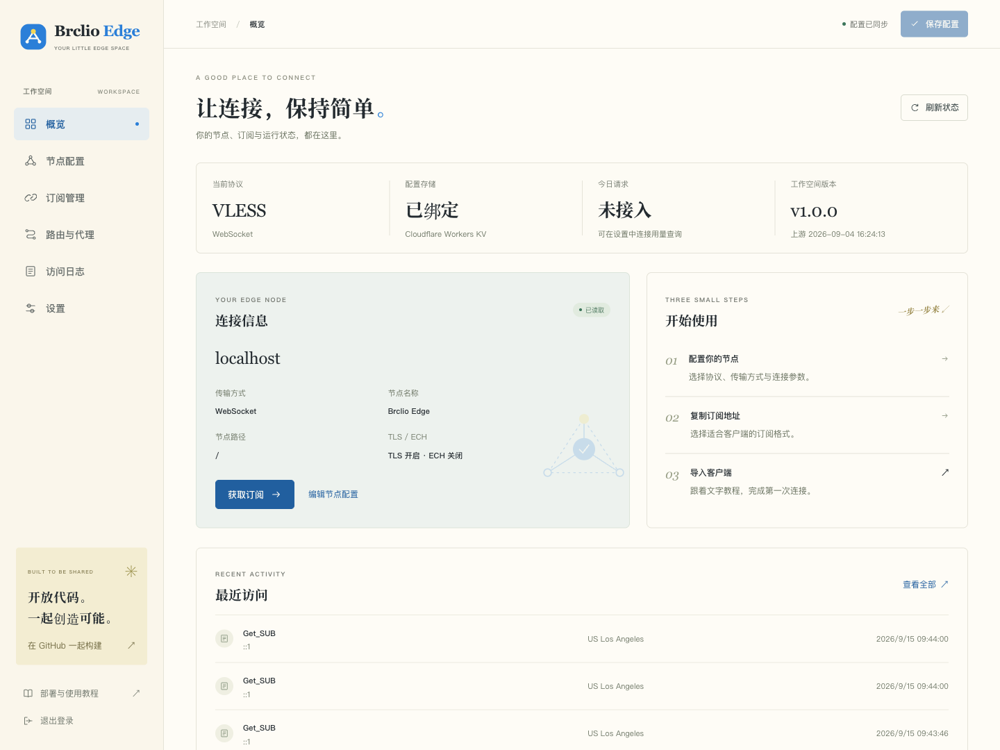
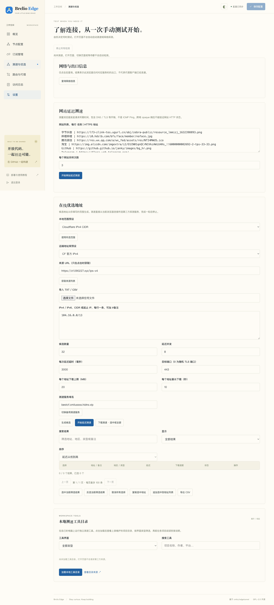
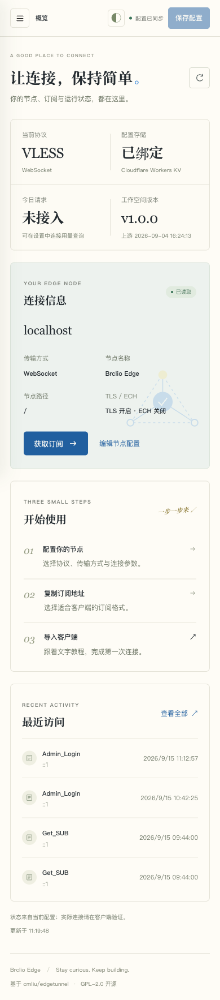
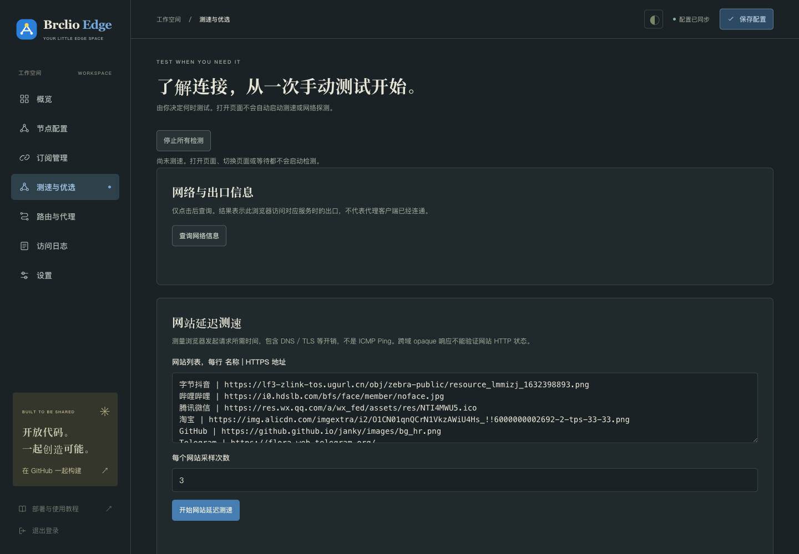
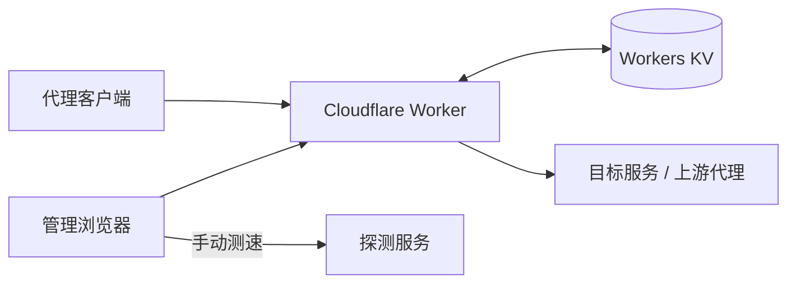

# Brclio Edge

运行于 **Cloudflare Workers / Pages** 的开源隧道管理面板。基于 [cmliu/edgetunnel](https://github.com/cmliu/edgetunnel) 的协议实现，提供独立的 Brclio 管理界面、订阅管理、手动测速与部署工具。

管理页面、样式、脚本、字体和二维码组件均在仓库内维护，构建后嵌入独立 Worker。项目以 **GPL-2.0-only** 开源，允许使用、修改、再分发和商业使用。

[下载 Release](https://github.com/Brclio/brclio-cloudflare-tz/releases/latest) · [高清部署图文教程](docs/tutorial.html) · [GitHub 自动部署与同步教程](docs/github-deploy.html) · [功能对照](docs/upstream-feature-matrix.md) · [验证记录](docs/validation.md) · [许可证](LICENSE)

两篇教程均为内嵌图片与字体的独立 HTML，可在仓库文件页选择 **Download raw file** 后打开；放在同一目录时可互相跳转。当前仓库版新增 28 张高清操作标注图，支持点击放大、原始尺寸查看和图片下载；也可下载下方 v1.0.4 的教程合集 ZIP，解压后打开。

## 快速部署

从 [GitHub Release](https://github.com/Brclio/brclio-cloudflare-tz/releases/latest) 下载预构建文件即可部署，无需安装 Node.js 或自行构建。下面是 **v1.0.4** 的部署包与教程：

| 下载文件 | 用途 |
| --- | --- |
| [brclio-edge-pages.zip](https://github.com/Brclio/brclio-cloudflare-tz/releases/download/v1.0.4/brclio-edge-pages.zip) | 推荐：直接上传到 Cloudflare Pages 的拖放部署入口 |
| [_worker.js](https://github.com/Brclio/brclio-cloudflare-tz/releases/download/v1.0.4/_worker.js) | 在 Workers 代码编辑器中替换全部示例代码 |
| [tutorial.html](https://github.com/Brclio/brclio-cloudflare-tz/releases/download/v1.0.4/tutorial.html) | 下载后双击打开的完整图文教程 |
| [github-deploy.html](https://github.com/Brclio/brclio-cloudflare-tz/releases/download/v1.0.4/github-deploy.html) | 通过 GitHub 配置、自动部署、维护与同步 |
| [brclio-edge-guides.zip](https://github.com/Brclio/brclio-cloudflare-tz/releases/download/v1.0.4/brclio-edge-guides.zip) | 推荐：两篇离线教程合集，解压后可互相跳转 |

仓库和 Release 均已公开，部署包与教程可直接下载，无需登录 GitHub。

创建自己的 Cloudflare 项目后，设置管理员机密 `ADMIN`、固定的 UUID v4 机密 `UUID`，并添加名称为大写 `KV` 的 KV 命名空间绑定；保存后重新部署，再访问 `https://你的域名/admin`。完整步骤见下载的 HTML 教程，配置表与其他部署方式见下方[部署说明](#部署说明)。

## 功能

当前源码的管理后台包含八个页面。侧栏新增「进阶配置」，页面顶部提供「我是高手，我要折腾」开关，与设置中的完整 / 简洁视图同步并记住选择。v1.0.4 部署包包含下述功能。

| 页面 | 主要功能 |
| --- | --- |
| 概览 | Workers / Pages 分段请求用量、日配额参考、UTC 重置倒计时；当前节点、域名与配置存储 |
| 节点配置 | 域名、UUID、名称、协议、传输与路径 |
| 进阶配置 | 高手模式、gRPC / Shadowsocks 细项、TLS / ECH / ALPN / 指纹、订阅转换、全部代理路径模板、工具直达及部署变量说明 |
| 订阅管理 | 节点与订阅链接、二维码、格式下载、自定义地址、订阅汇聚与单节点链式代理 |
| 测速与优选 | 网络信息、网站延迟、IPv4 / IPv6 候选生成、延迟与下载测速、筛选和导出 |
| 路由与代理 | ProxyIP、上游代理、域名白名单、按地区加载与验证公开代理；路径模板直达进阶页 |
| 访问日志 | 管理和订阅访问记录、搜索及类型筛选 |
| 设置 | 外观主题、完整 / 简洁视图、配置备份、原始 JSON、用量与通知、部署文件下载 |

### 协议与订阅

- **VLESS / Trojan**：WebSocket、gRPC `gun` / `multi`、XHTTP `stream-one`。
- **Shadowsocks**：AES-128-GCM / AES-256-GCM，通过 WebSocket 传输。
- **订阅输出**：通用 / Base64、Clash / Mihomo、sing-box、Surge、Quantumult X、Loon；部分格式使用配置的外部转换服务。
- **配置维护**：常用字段表单、完整 JSON 编辑、导入导出，以及登录后的当前 Worker / Pages ZIP 下载。

进阶配置使用同一份主配置，支持分组还原未保存的修改。保存后更新客户端订阅；Cloudflare 的环境变量仍在部署设置中修改。代理白名单现由每次隧道请求读取，`GO2SOCKS5` 继续作为强制附加规则；生产 KV 的传播遵循 Cloudflare 一致性机制。

v1.0.4 对照在线管理页补齐首页请求用量、三种认证方式与保存前验证，并新增 TOKEN / UUID / 地址 / ECH / 代理路由帮助。用量查询失败不会显示成零；需先在设置中接入自己的只读凭据。

具体兼容范围及验证状态见[功能对照](docs/upstream-feature-matrix.md)。可选的订阅转换、地址目录、探测、通知及代理出口服务仍有各自的外部依赖。

### 手动测速

测速只在点击后运行一轮，完成后停止；打开页面不会自动测速，也没有定时重测。可随时停止，离开测速页或页面进入后台会取消当前测速。

- 支持 IPv4、IPv6、CIDR、起止 IP 区间及 TXT / CSV 来源，候选数量为 **1–4096**。
- **生成候选只处理地址数据**；延迟测速与下载测速分别由按钮启动。
- 支持筛选、排序、勾选、复制、CSV 导出及追加到自定义地址列表。
- 追加后需分别保存 **地址列表 `ADD.txt`** 和 **主配置**，使用本地来源并关闭随机 IP，再更新客户端订阅。

测速由当前浏览器连接所选探测服务；网站延迟是请求耗时，下载测速会实际传输数据。结果受浏览器网络和服务可用性影响，客户端连接仍需单独验证。

## 界面预览

以下为本地运行截图。点击图片文件可查看原始尺寸；本地测试环境信息不代表生产出口。

### 管理概览

[](docs/images/admin-desktop.png)

### 测速与优选

[](docs/images/speedtest-desktop.png)

<details>
<summary>查看移动端与夜间主题</summary>

| 移动端管理 | 移动端测速 |
| --- | --- |
| [](docs/images/admin-mobile.png) | [](docs/images/speedtest-mobile.png) |

[](docs/images/speedtest-dark.png)

</details>

## 本地开发

修改源码或在本地运行时，需要 **Node.js 22 或以上版本**。

```sh
git clone https://github.com/Brclio/brclio-cloudflare-tz.git
cd brclio-cloudflare-tz
npm ci
cp .dev.vars.example .dev.vars
```

编辑 `.dev.vars`，设置自己的 `ADMIN` 密码和 UUID v4，然后启动：

```sh
npm run dev
```

打开 [http://localhost:8787/admin](http://localhost:8787/admin)，使用 `ADMIN` 登录。Windows PowerShell 可用 `Copy-Item .dev.vars.example .dev.vars` 复制示例配置。

本地运行使用 Wrangler 的本地 KV。`wrangler.toml` 中全零的 KV ID 是本地占位值，部署前必须替换；`.dev.vars` 与本地运行数据已被 Git 忽略。

### 构建与检查

| 命令 | 用途 |
| --- | --- |
| `npm run dev` | 构建并启动本地 Worker，端口 8787 |
| `npm run check` | 检查源码、前端和构建脚本的 JavaScript 语法 |
| `npm test` | 构建并运行自动化测试 |
| `npm run build` | 生成独立 Worker、Pages 目录、上传 ZIP 与构建清单 |
| `npm run build:tutorial` | 重新生成两篇内嵌高清配图的独立 HTML 教程 |

测试覆盖管理会话、配置持久化、订阅、真实 workerd 到本地 TCP 的协议转发、手动测速控制及下载产物再启动。具体执行环境、结果和限制见[验证记录](docs/validation.md)；本地与受控测试不等同于 Cloudflare 生产部署或公网客户端验收。

## 部署说明

普通部署使用上方 Release 中的预构建文件。需要修改代码、Git 集成或命令行部署时，再下载源码并执行 `npm ci && npm run build`。

| 方式 | 部署内容 / 命令 |
| --- | --- |
| Pages 控制台拖放（推荐） | 上传 Release 下载的 `brclio-edge-pages.zip` |
| Workers 控制台 | 将 Release 下载的 `_worker.js` 的完整内容放入代码编辑器 |
| Pages Git 集成（源码） | 构建命令 `npm ci && npm run build`，输出目录 `dist/pages` |
| Workers 命令行（源码） | 配置真实 KV namespace ID 和机密后执行 `npm run deploy` |
| Pages 命令行（源码） | 配置项目与绑定后执行 `npm run deploy:pages` |

生产环境的基本配置：

| 名称 | 类型 | 说明 |
| --- | --- | --- |
| `ADMIN` | 机密 | 必填，管理后台密码 |
| `KV` | KV 命名空间绑定 | 必须绑定自己的存储空间，名称为大写 `KV` |
| `UUID` | 机密 | 建议固定为自己的 UUID v4，作为节点身份凭据 |
| `HOST` | 环境变量，可选 | 固定节点域名，默认根据访问域名生成 |

Pages 的变量和绑定应设置在目标部署环境中，保存后重新部署。完成域名配置后访问 `https://你的域名/admin`。

**认准 Release 附件的文件名。** GitHub「Code → Download ZIP」和 Release 中的「Source code」都是源码，不能直接作为 Pages 部署包。自行构建时，对应产物是 `dist/brclio-edge-pages.zip`、`dist/_worker.js` 和 `dist/pages/`；不能直接粘贴带模块导入的 `src/worker.js` 到 Workers 编辑器。

已经运行本项目的实例，可在 **「设置 → 版本与开源项目」** 下载当前版本的 Worker 或 Pages ZIP。下载程序不包含运行时机密和 KV 私有数据；迁移时需重新配置环境变量、KV 绑定及所需数据。

### 完整教程

下载 [tutorial.html](https://github.com/Brclio/brclio-cloudflare-tz/releases/download/v1.0.4/tutorial.html) 后，**双击文件即可在浏览器打开**。教程是可独立打开的单文件 HTML，内嵌样式与截图；截图可按原始尺寸查看。另可下载 [GitHub 教程](https://github.com/Brclio/brclio-cloudflare-tz/releases/download/v1.0.4/github-deploy.html)。两篇保持原文件名并放在同一文件夹，或直接下载 [教程合集 ZIP](https://github.com/Brclio/brclio-cloudflare-tz/releases/download/v1.0.4/brclio-edge-guides.zip)。仓库内保留 [教程源码](docs/tutorial-src/README.md)、[后台原始 PNG](docs/tutorial-assets/original/) 和 [Cloudflare 标注图](docs/tutorial-assets/cloudflare/)。

教程包含账号与域名准备、KV 创建、Pages / Workers 部署、后台配置、客户端订阅及测速操作，并提供章节导航、进度勾选、命令复制和故障搜索。在 GitHub 文件页查看时，请先下载 HTML 文件再打开。

## 架构与目录



Worker 提供隧道、订阅和管理 API，KV 保存配置与日志。本地前端资源在构建时嵌入 Worker，管理界面无需运行时下载远端 HTML、字体或 CDN 脚本。

```text
src/
  worker.js                 隧道、订阅与管理路由
  panel.js                  登录会话、配置校验与页面资源
  admin-tools.js            手动目录与管理辅助接口
  grpc.js                   gRPC Hunk / MultiHunk 解析
  downloads.js              当前 Worker / Pages ZIP 下载
public/
  admin.html                管理后台
  login.html                登录页
  assets/                   样式、交互、测速、二维码及品牌资源
scripts/                    构建与语法检查
tests/                      自动化测试
docs/                       教程、设计、架构与验证文档
wrangler.toml               Workers 配置
.dev.vars.example           本地环境变量示例
```

## 文档导航

| 文档 | 内容 |
| --- | --- |
| [高清部署与使用教程](docs/tutorial.html) | 28 张 Cloudflare 操作标注图、9 张后台原图；下载 HTML 可离线阅读 |
| [GitHub 自动部署与同步教程](docs/github-deploy.html) | Fork、Pages Git 集成、构建配置、更新同步、迁移和回滚 |
| [架构与上游分析](docs/architecture.md) | 固定基线、请求分流、配置状态与外部依赖 |
| [上游功能对照](docs/upstream-feature-matrix.md) | 功能对应关系及实现、验证边界 |
| [Workers / Pages 请求用量](docs/request-usage.md) | 三种认证方式、请求统计、配额与重置说明 |
| [Worker 与原版的差异](docs/worker-differences.md) | 沿用的协议实现、实际行为修改及正确部署文件 |
| [管理 API 契约](docs/api-contract.md) | 管理接口、请求与配置行为 |
| [设计说明](docs/design.md) | Brclio 界面与交互设计 |
| [教程源文件](docs/tutorial-src/README.md) | 图文教程的维护、构建与原图更新 |
| [验证记录](docs/validation.md) | 自动化检查、真实浏览器操作与未执行的验收 |
| [第三方来源与许可](THIRD_PARTY_NOTICES.md) | 代码、字体、组件和其他材料的来源 |

## 贡献

欢迎提交问题、文档改进和代码变更。提交前请运行：

```sh
npm run check
npm test
npm run build
```

界面改动应检查桌面与移动端的重要操作；协议或管理行为改动应补充相关回归测试。问题报告请包含部署方式、客户端版本、复现步骤及错误信息，并移除管理密码、UUID、订阅 token 和代理凭据。

## 开源许可与署名

本项目采用 [GNU GPL-2.0-only](LICENSE)。允许个人及商业使用、修改与再分发；分发修改版本时，请遵守 GPL 的源码提供和许可证保留要求。

隧道与协议代码基于 **[cmliu/edgetunnel](https://github.com/cmliu/edgetunnel)**，固定基线为 [`448a83ced00a43c1d892d5ecbed86a26ea9eeaff`](https://github.com/cmliu/edgetunnel/commit/448a83ced00a43c1d892d5ecbed86a26ea9eeaff)，上游版本标识为 `2026-09-04 16:24:13`。Brclio 独立实现管理界面、构建工具、教程与本地改造，保留上游代码署名及贡献者来源。

完整来源、第三方组件许可证和设计材料边界见 [THIRD_PARTY_NOTICES.md](THIRD_PARTY_NOTICES.md)。字体和二维码组件保留各自的 OFL / MIT 许可证。
