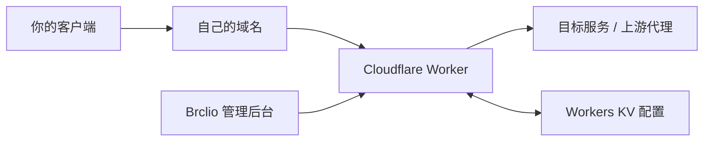

# Brclio Edge

**一个属于自己的 Cloudflare 边缘连接工作空间。**

基于 [cmliu/edgetunnel](https://github.com/cmliu/edgetunnel) 的协议实现，重新设计登录页、管理后台与部署指引。使用 Brclio 的暖纸色、蓝色与黄色视觉语言，让节点配置、订阅和日常维护更容易理解。

完整源码采用 **GPL-2.0-only** 开放：允许个人使用、修改、再分发和商业使用；分发衍生程序时请遵守 GPL 的源码与许可证要求。详见 [LICENSE](LICENSE) 和 [第三方来源与署名](THIRD_PARTY_NOTICES.md)。


## 这个项目可以做什么

- **管理自己的节点**：配置 VLESS、Trojan、Shadowsocks，以及 WebSocket、gRPC、XHTTP 等传输选项。
- **统一管理订阅**：复制单节点或订阅链接，按客户端选择输出格式，管理随机或自定义优选地址。
- **调整路由与代理**：使用自动 ProxyIP、自定义反代地址或已有的上游代理。
- **查看配置和日志**：检索访问记录，按需连接 Cloudflare 用量查询与 Telegram 通知。
- **保留完整配置能力**：表单用于常见设置，原始 JSON 编辑器保留高级字段；支持主配置导入、导出。
- **独立部署管理界面**：后台 HTML、CSS、JavaScript 与品牌资源都来自本项目，构建时打包进 Worker。

管理界面不依赖远程托管的管理 HTML 或外部 CDN 脚本。协议运行中的 ProxyIP、订阅转换等可选或上游默认服务仍有各自的外部依赖，见[高级设置](#高级设置)。

### 先理解三个东西

| 名称 | 可以怎样理解 | 在这里的用途 |
| --- | --- | --- |
| Cloudflare Pages / Workers | 运行代码的地方 | 接收连接、提供后台和生成订阅 |
| Workers KV | 保存设置的小仓库 | 保存节点配置、自定义地址及可选服务配置 |
| 自定义域名 | 你自己的访问入口 | 打开管理后台，作为客户端连接和订阅入口 |



本文讲的是在 Cloudflare 上运行应用代码。Cloudflare 自身的账号控制台仍由 Cloudflare 提供。

## 文字教程从哪里来

本教程依据零度解说的[指定视频](https://www.youtube.com/watch?v=chcFg878840)整理：**已完整阅读原视频字幕、查看覆盖全片的预览画面，并用 1080p 原视频关键帧核对操作。** 原片发布于 2026-04-02，约 14 分 24 秒。

下面保留原视频的 **Pages 拖放部署** 主线，并把文件名和后台操作替换为本项目实际实现。字幕中 `ADMIN` 的拼写及「自适应订阅」的识别错误已按画面纠正。详细依据见[视频观看与核对记录](docs/video-research.md)。

原视频的测速结果、免费域名权益和网站访问效果属于当时演示。实际费用、配额和可用性由服务商政策、账号及网络环境决定；Cloudflare 免费方案有请求、CPU 与 KV 用量限制。参阅 [Cloudflare 官方限制](https://developers.cloudflare.com/workers/platform/limits/)与[计费说明](https://developers.cloudflare.com/workers/platform/pricing/)。

### 阅读路线

1. [准备账号、域名与部署包](#第一步准备账号域名与部署包)
2. [将域名接入 Cloudflare](#第二步将域名接入-cloudflare)
3. [创建 KV 命名空间](#第三步创建-kv-命名空间)
4. [创建 Pages 并上传](#第四步创建-pages-并上传)
5. [设置 ADMIN 和 KV](#第五步设置-admin-和-kv)
6. [绑定域名并重新部署](#第六步绑定域名并重新部署)
7. [登录自己的管理后台](#第七步登录自己的管理后台)
8. [生成订阅并导入客户端](#第八步生成订阅并导入客户端)

---

## 第一步：准备账号、域名与部署包

对应原片：[01:01 域名准备](https://www.youtube.com/watch?v=chcFg878840&t=61s)、[03:25 Cloudflare 账号](https://www.youtube.com/watch?v=chcFg878840&t=205s)、[07:10 获取代码](https://www.youtube.com/watch?v=chcFg878840&t=430s)。

### 1. 准备这些内容

| 准备项 | 说明 |
| --- | --- |
| Cloudflare 账号 | 在 [Cloudflare](https://dash.cloudflare.com/) 注册或登录；教程按免费方案的操作入口说明 |
| 自己能够管理 DNS 的域名 | 推荐使用已经持有的域名或其子域名，无需为本教程另行购买 |
| 电脑上的 Node.js | 安装 [Node.js](https://nodejs.org/) 22 或以上版本，包含 npm |
| 本项目源码 | 从当前仓库下载源码 ZIP 并解压，或使用下面的 Git 命令 |
| 客户端 | 原片演示 [v2rayN](https://github.com/2dust/v2rayN)，使用其他客户端时选择相应订阅格式 |

原片使用 DNSHE 注册域名，演示了 `ccwu.cc`、`us.ci` 等后缀。想跟着原片了解该服务，可从[作者配套资料页](https://www.freedidi.com/23618.html)进入。注册额度、可选后缀、到期和续期条件应以服务商当前页面为准；已有域名的读者可以跳过这段。

### 2. 在自己电脑上构建部署包

如果会使用 Git，在终端依次执行：

```sh
git clone https://github.com/Brclio/brclio-cloudflare-tz.git
cd brclio-cloudflare-tz
npm ci
npm run build
```

如果下载的是 GitHub 的源码 ZIP，先解压，在包含 `package.json` 的文件夹打开终端，再执行最后两条命令。

构建完成后，项目里的 `dist` 文件夹会出现以下文件：

| 文件或目录 | 用途 |
| --- | --- |
| `dist/brclio-edge-pages.zip` | **本教程要上传到 Pages 的文件** |
| `dist/pages/` | Pages 命令行上传目录，也是 Pages Git 构建输出目录 |
| `dist/_worker.js` | 已打包的独立 Worker，可用于 Workers 控制台或 Wrangler |
| `dist/build-manifest.json` | 构建信息、资源列表与校验值 |

**请选择构建后的 `brclio-edge-pages.zip`。** GitHub 的「Download ZIP」得到的是源码，不能直接替代这个部署包；`src/worker.js` 也包含源码模块导入，不能直接整段粘贴到控制台运行。

**本步完成标志：** 电脑中存在 `dist/brclio-edge-pages.zip`。

## 第二步：将域名接入 Cloudflare

对应原片：[04:08 添加域名](https://www.youtube.com/watch?v=chcFg878840&t=248s)、[04:47 替换 NS](https://www.youtube.com/watch?v=chcFg878840&t=287s)。

如果你的域名已在同一个 Cloudflare 账号中正常托管，直接进入第三步。

1. 登录 Cloudflare，在域名入口选择「添加域名 / Add a domain」。
2. 输入你能够管理的域名，例如 `example.com`。输入域名本身，不加 `https://` 或网页路径。
3. 选择适合自己的方案。原片选择 **Free**。
4. 检查扫描到的 DNS 记录。如果域名已有网站或邮箱，要保留这些业务需要的记录。
5. Cloudflare 会分配两条名称服务器，也叫 **NS / Nameservers**。
6. 回到域名注册商的「名称服务器 / DNS 服务器」设置，把名称服务器改成刚分配给你的两条。
7. 返回 Cloudflare，选择已更新名称服务器并检查状态，等待域名显示 **Active / 已激活**。

这里填写的是 Cloudflare 为**你的域名**分配的 NS；不要复制视频作者的两条服务器。传播时间并不固定，原片中的几分钟仅是一次示例。

若只想把一个子域名接到 Pages，可以让原 DNS 服务商继续管理 DNS，再按第六步添加 CNAME；根域名的接入要求不同，见 [Pages 自定义域官方说明](https://developers.cloudflare.com/pages/configuration/custom-domains/)。

**本步完成标志：** 域名已激活，或者已经确定子域名的 DNS 由哪一家服务商管理。

## 第三步：创建 KV 命名空间

对应原片：[05:59 创建 KV](https://www.youtube.com/watch?v=chcFg878840&t=359s)。

1. 回到 Cloudflare 的账号首页。
2. 找到「存储和数据库 / Storage & databases → Workers KV」。
3. 选择「创建 / Create」。
4. 为命名空间取一个容易识别的名字，例如 `brclio-edge-config`。
5. 创建后记住这个名字，下一步会在列表中选它。

**这里的空间名称可以自己取；稍后绑定时的变量名称必须是大写 `KV`。** 两者用途不同。

**本步完成标志：** Workers KV 列表里能找到 `brclio-edge-config`。

## 第四步：创建 Pages 并上传

对应原片：[06:26 创建 Pages](https://www.youtube.com/watch?v=chcFg878840&t=386s)、[07:22 上传文件](https://www.youtube.com/watch?v=chcFg878840&t=442s)。

1. 打开「计算 / Compute → Workers 和 Pages / Workers & Pages」。
2. 选择「创建应用 / Create application」，进入 **Pages** 创建入口。
3. 选择「上传资产 / Upload assets」或「拖放文件」。不同版本的控制台文案可能略有变化。
4. 输入项目名称，例如 `brclio-edge`。名称被占用时换一个你自己的名称。
5. 将第一步生成的 **`dist/brclio-edge-pages.zip`** 拖入上传区域。
6. 确认文件上传完成后点击「部署站点 / Deploy site」。
7. 部署成功后继续进入项目。

Cloudflare 会给项目分配一个 `*.pages.dev` 地址，请记下控制台实际显示的地址。此时还未完成 `ADMIN` 和 `KV` 配置，看到安装提示是正常的。

本项目使用 Pages 的 `_worker.js` 高级模式，官方支持通过控制台拖放上传。直接上传模式与 Git 集成模式不能在同一项目内随意切换；希望自动跟随 Git 更新的读者，可直接选择后面的 [Pages Git 部署](#pages-git-部署)。[官方上传说明](https://developers.cloudflare.com/pages/get-started/direct-upload/)

**本步完成标志：** Pages 项目中出现首次成功部署。

## 第五步：设置 ADMIN 和 KV

对应原片：[07:41 设置管理密码](https://www.youtube.com/watch?v=chcFg878840&t=461s)、[08:04 添加 KV 绑定](https://www.youtube.com/watch?v=chcFg878840&t=484s)。

### 1. 设置管理密码

进入刚创建的 **Pages 项目 → 设置 → 变量和机密**，确认当前编辑的是 **生产 / Production** 环境。

新增：

| 项目 | 填写内容 |
| --- | --- |
| 类型 | 机密 / Secret；若界面显示「加密」选项，请启用 |
| 变量名称 | `ADMIN` |
| 值 | 你自己生成并保存的长随机密码 |

名称是 **`ADMIN`，共五个英文字母，全部大写**。视频字幕少了一个 `I`，实际画面是正确的。此变量的值就是管理密码，不需要另外创建用户名。

### 2. 绑定刚才的 KV

进入 **设置 → 绑定 / Bindings → 添加 → KV 命名空间**：

| 项目 | 填写内容 |
| --- | --- |
| 变量名称 / Binding name | `KV` |
| KV 命名空间 | 选择第三步创建的 `brclio-edge-config` |
| 环境 | 生产 / Production |

保存。`KV` 区分大小写，不能写成 `kv`，也不能把命名空间的显示名写到绑定名里。

### 3. 建议同时设置固定 UUID

`UUID` 是客户端使用的节点身份标识。可以新增名为 `UUID` 的机密，填入自己生成的 **UUID v4**。电脑上可执行：

```sh
node -e "console.log(require('node:crypto').randomUUID())"
```

把本次生成的值保存到你自己的配置中，不使用教程里的共享示例值。设置固定 `UUID` 后，后续单独更换 `ADMIN` 密码不会因此改变 UUID；未设置时，程序会从管理密码与密钥派生 UUID。

其他常见环境变量：

| 变量 | 是否需要 | 用途 |
| --- | --- | --- |
| `ADMIN` | 必填 | 管理密码 |
| `KV` | 必须绑定资源 | 不是普通文本变量，而是 KV 命名空间绑定 |
| `UUID` | 建议 | 固定节点 UUID v4 |
| `HOST` | 可选 | 固定节点域名，例如 `edge.example.com`；默认依据当前访问域名 |
| `KEY` | 可选 | 自定义密钥；修改后旧管理会话失效，未固定 UUID 时也会影响派生 UUID |
| `OFF_LOG` | 可选 | 设为 `true` 可关闭 KV 访问日志记录 |
| `PROXYIP` | 可选 | 自定义默认反代地址，先用默认配置完成连接再调整 |

新变量和绑定要在**下一次部署**中才生效。原片和 [Cloudflare 官方绑定说明](https://developers.cloudflare.com/pages/functions/bindings/)都包含这一点，请继续完成第六步。

**本步完成标志：** 生产环境存在 `ADMIN` 机密，且 `KV` 指向自己创建的命名空间。

## 第六步：绑定域名并重新部署

对应原片：[08:32 自定义域](https://www.youtube.com/watch?v=chcFg878840&t=512s)、[09:58 再次部署](https://www.youtube.com/watch?v=chcFg878840&t=598s)。

### 1. 添加自定义域

1. 打开 **Pages 项目 → 自定义域 / Custom domains → 设置自定义域**。
2. 输入实际使用的域名，例如 `edge.example.com`，点击继续。
3. 查看 Cloudflare 提供的 DNS 记录。
4. 如果域名已由同账号的 Cloudflare 管理，界面可能会自动添加 CNAME，按提示确认即可。
5. 如果需要手动配置，在负责该域名的 DNS 控制台新增 CNAME：名称填写对应子域，目标填写**本 Pages 项目**的 `*.pages.dev` 地址。
6. 回到 Pages 激活域名，等待验证与证书准备完成，状态变为 **Active / 已激活**。

示意如下，填写时以自己控制台的数据为准：

| 类型 | 名称 | 目标 |
| --- | --- | --- |
| CNAME | `edge` | `你的项目.pages.dev` |

必须先在 Pages 添加自定义域，再处理 DNS。仅在 DNS 中增加 CNAME、没有关联 Pages 项目，可能返回 522。已有相同名称记录时应先核对用途，避免产生冲突。[官方自定义域说明](https://developers.cloudflare.com/pages/configuration/custom-domains/)

### 2. 重新上传并部署到生产环境

1. 返回 Pages 的「部署」页面。
2. 选择「创建部署 / Create deployment」。
3. 环境选择 **生产 / Production**。
4. 再次上传 `dist/brclio-edge-pages.zip`。
5. 点击「保存并部署」，等待新部署成功。

这一步会让第五步的变量和 KV 绑定进入实际运行的版本。每次修改此类部署配置后，都应创建新部署。

**本步完成标志：** 自定义域显示已激活，最新生产部署的时间晚于变量和绑定的保存时间。

## 第七步：登录自己的管理后台

对应原片：[10:21 登录后台](https://www.youtube.com/watch?v=chcFg878840&t=621s)。

在浏览器访问：

```text
https://edge.example.com/admin
```

将域名换成自己的。未登录时会进入 Brclio 登录页，输入第五步设置的 `ADMIN` 密码。

登录成功后会看到六个入口：

| 本项目页面 | 用来做什么 | 对应原片内容 |
| --- | --- | --- |
| 概览 | 查看协议、配置存储状态和连接信息 | 原片登录后的设置页概况 |
| 节点配置 | 协议、传输方式、路径、TLS 等 | 原片高级设置里的详细配置 |
| 订阅管理 | 复制链接、选择输出格式、配置优选来源 | 获取节点链接、优选订阅生成 |
| 路由与代理 | ProxyIP、上游代理和域名白名单 | Cloudflare CDN 访问设置 |
| 访问日志 | 查找实际管理与订阅访问记录 | 原上游日志能力 |
| 设置 | 可选用量/通知、主配置备份、完整 JSON | 原片高级设置及本项目维护功能 |

修改常规表单后，点击右上角 **「保存配置」**，看到成功状态后再离开。地址列表、用量凭据、Bot 凭据使用各自的保存按钮。

管理登录会话有效期为 24 小时。退出后需要重新登录。后台能够读取配置，说明管理与存储链路正常；客户端能否连通，还需要下一步验证。

**本步完成标志：** 用自己的密码登录，概览中能显示实际域名和已读取的配置。

## 第八步：生成订阅并导入客户端

对应原片：[10:40 订阅设置](https://www.youtube.com/watch?v=chcFg878840&t=640s)、[11:25 导入客户端](https://www.youtube.com/watch?v=chcFg878840&t=685s)。

### 1. 先认识两种链接

| 链接 | 外观 | 用法 |
| --- | --- | --- |
| 单节点链接 | `vless://…`、`trojan://…` 等 | 导入一个节点；修改配置后通常需要重新导入 |
| 订阅地址 | `https://你的域名/sub?token=…` | 客户端通过此地址获取节点列表，以后可以更新 |

视频中的第二栏是 **「自适应订阅」**，不是另一种协议。日常使用推荐复制订阅地址。

### 2. 配置订阅来源

打开 **「订阅管理」**：

1. 初次使用保留本地来源和随机 IP，先用少量节点完成连接。
2. 按需要设置随机数量和端口。原片将数量改成 50，但它只是演示；数量并不代表带宽或一定更快。
3. 点击顶部 **「保存配置」**。
4. 在「订阅与节点链接」中选择输出格式：v2rayN 可先使用 **自动识别** 或 **通用 / Base64**；其他客户端选择相应格式。
5. 点击复制订阅。也可以用「下载当前格式」保存配置文件。

如果使用自定义地址：

1. 在订阅来源中使用本地地址库，并关闭「随机 IP」。
2. 在「自定义优选地址」每行填写一个自己验证可用的地址。
3. 点击 **「保存地址列表」**；再点击顶部 **「保存配置」**，保存来源开关。

地址写法示意：

```text
自己的优选地址:443#节点备注
```

这里的「自己的优选地址」必须替换为真实可用的 IP 或域名。随机地址池属于候选入口，最终性能需要客户端实测。

### 3. 在 v2rayN 中导入

1. 从 [v2rayN 官方仓库](https://github.com/2dust/v2rayN)获取适合自己系统的版本。
2. 在 Brclio 后台复制订阅地址。
3. 打开 v2rayN，使用「配置项 → 从剪贴板导入分享链接」。若当前版本没有自动识别为订阅，可以在「订阅分组」新增分组并粘贴订阅 URL。
4. 在「订阅分组」执行更新，等待列表中出现节点。**导入地址和更新节点列表是两个动作。**
5. 选择节点，测试连接，再设为活动配置。
6. 按客户端提示启用系统代理，选择适合自己的路由模式；原片演示的是全局代理。
7. 用浏览器访问实际需要的站点，检查连接结果。完成测试后，按自己的日常需求调整代理模式。

原片使用 v2rayN V7.16.8，新版菜单可能不同，可参阅 [v2rayN 官方 UI 说明](https://github.com/2dust/v2rayN/wiki/Description-of-some-ui)。

后台改过协议、路径、UUID、域名或订阅来源后，回到客户端更新订阅。管理页面显示「已保存」不会自动更新客户端已有的配置。

### 4. 完成后的检查

- 自定义域通过 HTTPS 正常打开。
- `/admin` 可以使用自己的管理密码登录。
- 修改一个配置后保存、刷新，设置仍然存在。
- 客户端更新订阅成功，能看到节点。
- 活动节点能完成实际网络请求。

前四项验证配置链路，最后一项验证实际连接。速度、出口地区和第三方站点可用性请以自己的测试为准。

## 高级设置

对应原片：[13:02 高级配置](https://www.youtube.com/watch?v=chcFg878840&t=782s)。

### ProxyIP 与上游代理

在 **「路由与代理」** 设置自动或自定义 ProxyIP、已有上游代理和域名白名单。ProxyIP 决定 Worker 某些连接的后续出口，它与客户端访问的入口域名不同。

原片演示了按地区选择第三方 ProxyIP。第三方地址可能变动；只有自己验证可用、来源可信的地址才适合长期配置。更复杂的路径模板可在 **「设置 → 原始配置 JSON」** 修改。

### 订阅转换

在 **「订阅管理 → 订阅转换选项」** 配置转换后端与规则文件。Clash、sing-box 等某些输出格式沿用上游的外部订阅转换服务；通用订阅和单节点链接可用于先完成基本连接。

使用外部转换时，该服务会参与获取与处理转换所需的订阅配置。需要自行控制此环节时，可设置自己的转换后端。后台界面本身不从转换后端加载脚本或样式。

### 用量、日志与通知

- **今日请求**：在「设置」中接入自己的 Cloudflare 用量查询配置后显示。未配置时的空状态不代表零用量，也不是实时带宽。
- **访问日志**：记录订阅获取与管理操作。设置 `OFF_LOG=true` 时不会继续写入 KV 日志。
- **Telegram**：先保存自己的 Bot 配置，再启用通知开关并保存主配置；不是安装必填项。

### 备份与恢复

使用 **「设置 → 导出主配置」** 保存 JSON。恢复时导入 JSON，确认内容后保存主配置。

主配置备份**不包含**单独存储的 Cloudflare 查询凭据、Telegram Bot 凭据和 `ADD.txt` 地址列表。完整迁移时需要分别保留这些内容；环境变量和 KV 绑定也要在新部署中重新设置。

原始 JSON 中没有表单入口的字段仍可编辑。先应用 JSON，再点击顶部「保存配置」。`HOST`、`UUID` 等运行时字段以实际域名和部署环境变量为准。

## 常见问题

| 现象 | 先检查什么 |
| --- | --- |
| `npm ci` 失败 | Node.js 是否为 22 或以上；终端是否位于包含 `package.json` 的项目根目录；npm 网络是否可用 |
| Pages 上传后只有静态提示、找不到后台 | 是否上传了本项目构建后的 ZIP；确认 `_worker.js` 位于上传包根目录 |
| 页面提示未完成初始化或 KV 未绑定 | 生产环境是否存在 `ADMIN`；绑定名是否为大写 `KV`；绑定后是否重新部署 |
| 密码一直不正确 | 登录密码是 `ADMIN` 的值；检查输入法、空格和实际生产环境的值 |
| 改了密码仍在用旧配置 | 变量保存后是否创建了新的生产部署；重新登录再检查 |
| 自定义域一直验证中 | NS 是否生效；CNAME 目标是否为自己的 Pages 地址；是否有冲突记录或证书限制 |
| 域名出现 522 | 是否只建了 CNAME，而没有在 Pages 的「自定义域」中关联域名 |
| `/admin` 能打开，客户端不能连 | 分别检查客户端协议/传输兼容性、订阅是否最新、实际入口/出口连通性；后台成功不等于隧道通过实测 |
| 浏览器打开订阅看到一串文字 | 订阅是供客户端读取的数据；将 URL 导入客户端，或使用明确匹配的输出格式 |
| 订阅为空或导入报错 | 用通用格式测试；检查订阅来源、自定义地址与外部转换后端是否可用 |
| 自定义地址保存后没生效 | 地址列表独立保存后，还要关闭随机 IP 并保存主配置，最后更新客户端订阅 |
| 换密码后节点失效 | 未设置固定 UUID 时，管理密码会影响派生 UUID；设置自己的固定 UUID 后重新获取并更新订阅 |
| 请求用量不显示 | 用量查询是可选配置；未配置时不会提供虚构的统计数字 |
| 原片的速度、地区与自己不同 | 原片只是作者当时的测试，结果受网络、候选入口、出口和目标服务影响 |

## 本地开发

本地预览使用 Wrangler 的本地运行环境，不需要先发布到 Cloudflare。

```sh
npm ci
cp .dev.vars.example .dev.vars
```

Windows PowerShell 可将复制命令改为：

```powershell
Copy-Item .dev.vars.example .dev.vars
```

打开 `.dev.vars`，替换 `ADMIN` 的示例值，生成自己的 UUID 并替换 `UUID`；然后启动：

```sh
npm run dev
```

访问 [本地管理后台](http://localhost:8787/admin)，使用 `.dev.vars` 中设置的密码登录。

`wrangler.toml` 中全零的 KV ID 是本地占位值；本地 KV 数据由 Wrangler 保存，与 Cloudflare 生产数据独立。`.dev.vars` 和本地运行数据已被 Git 忽略，不应放进发布包。

### 常用命令

| 命令 | 作用 |
| --- | --- |
| `npm run dev` | 构建并在 8787 端口启动本地 Worker |
| `npm run check` | 检查源码 JavaScript 语法 |
| `npm test` | 运行自动化测试 |
| `npm run build` | 构建 Worker、Pages 目录和上传 ZIP |
| `npm run deploy` | 构建并发布 Workers，需要真实账号与配置 |
| `npm run deploy:pages` | 构建并上传 Pages 目录，需要已有项目与账号配置 |

本地界面、接口与测试通过不能替代 Cloudflare 线上隧道、客户端和不同网络的实测。本仓库不将未执行的线上部署或连通性写作已通过。

## 其他部署方式

### Workers 命令行部署

先完成本地依赖安装，再使用自己的 Cloudflare 账号：

```sh
npx wrangler login
npx wrangler kv namespace create KV
```

将命令返回的真实 namespace ID 填入 `wrangler.toml` 的 `[[kv_namespaces]]` 中，替换全零占位值；可以同时修改 `name` 为自己的 Worker 名称。

然后设置机密并部署：

```sh
npx wrangler secret put ADMIN
npx wrangler secret put UUID
npm run deploy
```

各命令提示输入时填入自己的管理密码和 UUID。首次设置机密可能提示创建同名 Worker，按自己的部署计划完成创建。部署后在 Workers 控制台确认 KV 绑定与机密正确，再按需要添加自定义域。

### Workers 控制台部署

1. 在 Cloudflare 创建自己的 Worker。
2. 本地执行 `npm run build`。
3. 打开 `dist/_worker.js`，将完整构建结果替换到 Worker 代码编辑器。
4. 在 Worker 设置中添加 `ADMIN`、建议的固定 `UUID` 和名为 `KV` 的资源绑定。
5. 保存并部署，访问实际域名的 `/admin`。

直接粘贴的是 **`dist/_worker.js`**，不是 `src/worker.js`。后台资源已内嵌在构建后的文件中。

### Pages Git 部署

如果希望提交代码后自动构建，创建 Pages 项目时选择 Git 集成并连接自己的仓库，使用：

| 构建项 | 值 |
| --- | --- |
| 框架预设 | 无 / None |
| 构建命令 | `npm ci && npm run build` |
| 输出目录 | `dist/pages` |
| 根目录 | 项目根目录 |
| Node.js | 22 或以上，可按控制台支持方式设置 `NODE_VERSION=22` |

随后同样设置生产环境 `ADMIN`、`UUID` 与 `KV`，再触发新的生产部署。预览分支若需测试，请配置独立的预览环境和测试 KV，避免与生产混用。Git 集成的后续行为见 [Cloudflare 官方说明](https://developers.cloudflare.com/pages/configuration/git-integration/)。

## 项目结构与二次开发

```text
src/worker.js             隧道、订阅及管理接口的集成入口
src/panel.js              管理认证、响应、配置校验与本地资源访问
public/                  Brclio 登录页、管理页与初始化提示
public/assets/           本地样式、交互代码与品牌资源
scripts/build.mjs        构建独立 Worker 和 Pages 上传包
tests/                   自动化验证
docs/video-research.md   指定视频观看证据与纠错记录
wrangler.toml            Workers 部署配置，本地 KV ID 为占位值
.dev.vars.example        本地配置示例
```

修改界面后执行构建即可将新资源打入部署包。默认品牌资源和页面均在仓库内，可以按许可证修改为自己的名称与样式。

本次构建、31 项自动化测试、真实浏览器操作与响应式截图见[本地验证记录](docs/validation.md)；源码结构与本地改造差异见[架构分析](docs/architecture.md)。

贡献前请运行 `npm run check`、`npm test` 和 `npm run build`，并检查桌面与移动端的重要操作。提交问题时描述部署方式、所用客户端、操作步骤与错误信息；公开内容中请移除管理密码、UUID、订阅 token 和代理凭据。

## 来源、版权与开放使用

- **协议与隧道基础**：[cmliu/edgetunnel](https://github.com/cmliu/edgetunnel)。本次基础版本为 `2026-09-04 16:24:13`，固定提交 [`448a83ced00a43c1d892d5ecbed86a26ea9eeaff`](https://github.com/cmliu/edgetunnel/commit/448a83ced00a43c1d892d5ecbed86a26ea9eeaff)。
- **视觉设计与本项目改造**：Brclio，采用 Brclio Design System 的视觉语言重新实现管理工作空间。
- **教程参考**：[零度解说指定视频](https://www.youtube.com/watch?v=chcFg878840)，感谢原作者的演示与资料组织。本文是适配本项目的独立文字教程。
- **代码许可证**：[GPL-2.0-only](LICENSE)。本项目发布的代码允许商业使用；不额外加上「仅非商业」限制。
- **第三方材料**：各原作者署名及许可证详见 [THIRD_PARTY_NOTICES.md](THIRD_PARTY_NOTICES.md)。原视频和原作者素材不因本项目开源而自动改为 GPL。

欢迎使用、改造、分享，并继续保留上游和贡献者的来源。
