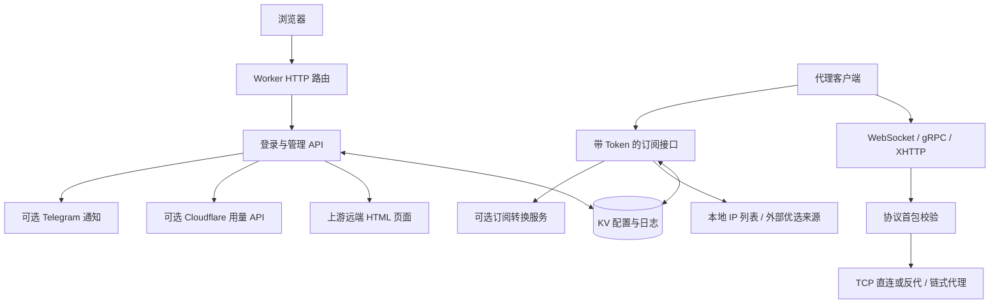

# 架构与上游分析

本文记录重做管理界面之前，对 **cmliu/edgetunnel 固定版本**的源码审阅。它是理解继承代码的依据；具体本地改动和验证结果以本仓库代码、变更记录及测试输出为准。源码阅读不等同于所有客户端与 Cloudflare 线上协议测试通过。

## 1. 分析基线

| 项目 | 固定值 |
| --- | --- |
| 上游仓库 | [cmliu/edgetunnel](https://github.com/cmliu/edgetunnel) |
| 上游提交 | [`448a83ced00a43c1d892d5ecbed86a26ea9eeaff`](https://github.com/cmliu/edgetunnel/commit/448a83ced00a43c1d892d5ecbed86a26ea9eeaff) |
| 源码中的 `Version` | `2026-09-04 16:24:13` |
| 审阅日期 | 2026-09-15 |
| 上游入口 | `_worker.js`，一个 ES module 的 `fetch(request, env, ctx)` |
| 上游 Wrangler 配置 | `main = "_worker.js"`、`compatibility_date = "2025-11-04"`、`keep_vars = true`；KV 示例未启用 |
| 上游许可证文件 | GNU General Public License, Version 2 |

上游没有前端源码目录、构建脚本或自动化测试配置。管理页和登录页在运行时从另一站点读取，因此只下载 `_worker.js` 并不能得到可独立维护的完整界面。

## 2. 一张图理解项目

**重做页面的最小边界**：本地提供登录、管理、缺少配置提示和静态资源，继续调用经过适配的管理 API，保留代理协议与订阅生成的原有数据格式。这样界面的品牌、可访问性和维护归属可以独立改变，现有客户端连接格式仍可延续。

## 3. 请求分流顺序

上游按以下顺序处理请求，顺序会影响新增页面和接口：

1. 清理请求 URL 的反斜线等形式，计算管理员密码、UUID、HOST 与反代参数。
2. `/version`：进行特定 UUID 比较，返回版本号。
3. 配置了管理员密码时，所有 WebSocket upgrade 请求先进入代理入口。
4. 配置了管理员密码时，非 `/admin/…`、非 `/login` 的 POST 请求进入 gRPC 或 XHTTP。**`POST /admin` 也会进入这一分支**；管理 API 应使用明确子路径。
5. 普通 HTTP 请求跳到 HTTPS；缺少管理员密码时取远端提示页。
6. KV 可用时处理快捷订阅、登录、管理、退出、订阅和辅助接口。
7. 其余请求返回伪装页，或代理到 `env.URL` 指定站点。

管理页面改造不能把新的保存接口放在任意公共 POST 路径，否则可能被协议入口接走。具体管理契约见 [api-contract.md](api-contract.md)。

## 4. 三类状态

### 4.1 环境变量

| 字段 | 上游作用 |
| --- | --- |
| `ADMIN` | 管理员密码的推荐变量名；源码还兼容 `admin`、`PASSWORD`、`password`、`pswd`、`TOKEN`、`KEY`、`UUID`、`uuid`，按此顺序取第一个真值 |
| `UUID` | 有效的 UUID v4 时成为协议凭证；否则用管理员密码与 KEY 派生 UUID |
| `KEY` | 参与 UUID、登录 Cookie 的派生；设置为非默认值时还成为快捷订阅路径 |
| `HOST` | 订阅使用的域名，可用逗号或换行分隔；覆盖 KV 的 HOSTS |
| `PATH` | 订阅的基础路径；覆盖 KV 的 PATH |
| `KV` | Cloudflare KV namespace 绑定，保存配置、优选地址和日志 |
| `PROXYIP` | 显式默认反代池；否则使用上游按 `request.cf.colo` 拼接的外部反代域名 |
| `GO2SOCKS5` | 在默认代理白名单上追加域名 |
| `URL` | 兜底伪装页：`nginx`、`1101` 或外部站点 |
| `DEBUG` | `1` / `true` 开启调试输出 |
| `OFF_LOG` | `1` / `true` 关闭 KV 日志写入；不会关闭已经启用的 Telegram 通知 |
| `BEST_SUB` | 允许符合指定参数、UA 的优选订阅生成器请求 |
| `TCP_CONCURRENT_DIAL` | TCP 竞速拨号并发数，最小 1；未显式设置时存在运营商适配 |
| `PROXY_CONCURRENT_DIAL` | 反代竞速拨号并发数，最小 1 |
| `PRELOAD_RACE_DIAL` | `1` / `true` 开启预加载竞速拨号 |

管理页面不应承诺在 KV 中修改 `UUID`、`HOST` 就能替代环境变量。读取配置时，这些值会重新按当前环境与请求生成。

### 4.2 KV 键

| KV 键 | 内容 | 读取表现 |
| --- | --- | --- |
| `config.json` | 协议、传输、订阅、反代、界面可编辑设置 | 读取时补充部分默认值、覆盖环境字段、生成 LINK/TOKEN，并合并用量与脱敏凭证状态 |
| `ADD.txt` | 优选地址、优选 API、其他节点等文本列表 | 为空时读取接口可能临时生成随机 IP；这不代表已保存该列表 |
| `cf.json` | Cloudflare 用量查询凭证，或自定义 UsageAPI | 凭证不作为独立 GET API 返回；配置响应只提供脱敏摘要 |
| `tg.json` | Telegram BotToken / ChatID | 通过配置响应返回脱敏摘要 |
| `log.json` | 管理与订阅事件数组 | 上游为整体读改写，并按约 4 MiB 的字符串长度裁剪 |

`config.json` 的 GET 响应是**有效配置快照**，并非磁盘原文。保存完整快照可以兼容上游，但不应把其中掩码后的 CF/TG 凭证再次写回专用凭证接口。

### 4.3 请求和连接状态

上游每个连接创建自己的流、缓冲区、写入队列与重连世代；但配置对象、调试开关、拨号并发数和白名单也存在模块级可变变量。Worker isolate 可处理交错的异步请求，这些全局变量需要与真正的只读常量区分。

## 5. 协议与订阅能力

| 层级 | 源码中实现的能力 | 使用边界 |
| --- | --- | --- |
| 入站协议 | VLESS、Trojan、Shadowsocks AEAD | 配置决定生成的节点协议；入站仍需要解析和校验首包 |
| 传输 | WebSocket、gRPC、XHTTP `stream-one` | gRPC 含 `gun` / `multi` 参数；XHTTP 使用基于 UUID 的 padding 标识 |
| Shadowsocks | WebSocket 插件形式，AES-GCM 配置 | 不应把普通裸 SS TCP 客户端直接视为兼容 |
| 出站 | TCP 直连、PROXYIP 兜底、SOCKS5、HTTP、HTTPS、TURN、SSTP；另含 Trojan 反代路径 | 真实可用性取决于 Cloudflare 运行时及所配置的出站服务 |
| DNS | 将指定的 DNS 数据转换或转发到 `8.8.4.4:53` 的 TCP 连接 | 普通 VLESS/Trojan UDP 分支主要限 DNS；Trojan 反代另有转发分支，不能宣传为默认支持任意 UDP |
| 原始订阅 | mixed 链接列表，按客户端 / 参数输出明文或 Base64 | 需要有效订阅 Token |
| 转换订阅 | Clash/Mihomo、sing-box、Surge、Quantumult X、Loon | 非 mixed 格式通常调用外部转换服务；有 Clash、sing-box、Surge 的输出修补 |
| 附加参数 | ECH、Fingerprint、ALPN、0-RTT、TLS 分片、随机路径 | 很多是写入客户端配置的参数，不能等同于服务端或所有客户端均已支持 |

随机优选函数从 CIDR 中抽取地址，**并没有逐个测量延迟或吞吐量**。“随机候选地址”比“已测速的最快节点”更准确。部分连通性检测站点还会被服务端直接回复 204，检测为成功不能证明所有目标站都能访问。

## 6. 外部依赖清单

| 依赖 | 触发时机 | 界面重做时的处理 |
| --- | --- | --- |
| `https://edt-pages.github.io` | 登录、管理、无 ADMIN、无 KV 页面 | 以本仓库页面替换，避免管理界面运行时取远端 HTML |
| 上游默认 PROXYIP 域名 | TCP 兜底 | 显示配置来源；支持部署者自行指定 |
| GitHub Raw 上的 CIDR 列表 | 随机地址生成 | 请求失败有固定 CIDR fallback；它是数据依赖，不是页面资源 |
| 默认 SUBAPI 与 ACL4SSR 配置 | Clash 等订阅转换 | 明确转换服务地址，允许部署者替换；转换流程存在第三方信任边界 |
| 部署者填写的优选 API / SUB | 优选地址生成 | 显示来源并在错误时给出有效反馈 |
| `api.cloudflare.com/client/v4` | 配置了用量凭证时 | 用量失败显示“未获取”，不要显示为真实零用量 |
| `speed.cloudflare.com/locations` | 登录后的 `/locations` | 可选辅助信息 |
| Telegram Bot API | 启用通知并配置 BotToken/ChatID 时 | 属于对外消息；默认关闭，只有用户主动设置后启用 |
| DoH 服务 | DNS / 反代解析或 ECH 参数 | 保留可配置地址与网络失败处理 |
| `env.URL` 指定站点 | 未匹配路由的兜底代理 | 应隔离管理 Cookie 和认证头 |

页面资源全部本地化，不代表订阅转换、IP 来源或协议出站不再访问第三方。

## 7. 源码确认的问题与最小修复方向

下表是**上游基线问题**，不是对本地修复状态的断言。

| 问题 | 源码证据 | 最小兼容方向 |
| --- | --- | --- |
| 管理界面依赖远端 HTML | `_worker.js` 第 4、107、289 行附近 | 在仓库内维护页面与资源，由自身 Worker 返回 |
| 登录凭证没有服务端过期时间 | Cookie 由 UA、KEY、ADMIN 确定性派生；Max-Age 只写在响应头 | 使用带到期时间的签名会话或随机服务器会话；保留 `/login` 的表单与成功 JSON 形状 |
| 退出只清浏览器 Cookie | `/logout` 不撤销原始凭证 | 真正的会话撤销需要会话状态或密钥轮换；不要把清 Cookie 描述为所有会话失效 |
| GET 也能重置配置 | `/admin/init` 在 method 分支之前 | 只允许 POST；使用同源检查，前端以明确操作触发 |
| 配置校验不足 | POST config 仅检查 `UUID`、`HOST`，后续直接访问嵌套对象 | 服务端校验类型和结构，拒绝畸形对象；页面基于完整快照更新可编辑字段 |
| 全局配置可跨异步请求交错 | 模块级 `let config_JSON`，多处 await 后继续使用 | 改为请求局部配置，通过参数传递到辅助函数 |
| 兜底外站收到原始 Cookie/Authorization | `new Headers(request.headers)` 后直接 fetch `env.URL` | 删除 Cookie、Authorization 与其他站点私密头后再转发 |
| 订阅 Token 被写入日志及通知 | `日志内容.URL = request.url`，TG 文本含 query | 对 `token`、`uuid`、代理账号等参数脱敏，再记录或展示 |
| 用量接口把敏感凭证放进 query | `/admin/getCloudflareUsage?GlobalAPIKey=…` 等 | 新面板用 POST body 的兼容适配接口或先保存凭证再查询，避免 URL 携带密钥 |
| 用量失败常以 200 + `success:false` 返回 | `getCloudflareUsage` 内部 catch 返回默认对象 | UI 同时检查 HTTP 状态和业务 success，不把未获取状态当作 0 |
| 配置读取会拉取用量，读取有延迟与外部依赖 | `读取config_JSON` 内调用 UsageAPI / Cloudflare API | 将用量查询独立或加入短缓存、超时与失败状态 |
| KV 日志整体读改写 | `get('log.json')` 后 `put` 整个数组 | 低并发可保留；更高可靠性需要独立日志服务或串行化写入，不能承诺无丢失 |
| TCP 连接器依赖非标准请求属性 | `创建请求TCP连接器` 只调用 `request.fetcher.connect` | 使用 Cloudflare 官方 `cloudflare:sockets` 适配，并在目标运行时验证 |
| 自带 TLS 客户端不做完整证书链验证 | `acceptCertificate` 仅检查证书非空；部分调用标明 insecure | 不声称证书验证完整；优先使用平台提供的受验证 TLS 通道或明确限制支持范围 |
| 缺少 request.cf 时可直接异常 | 入口读取 `request.cf.colo` 等 | 本地预览提供受控元数据或使用可选链默认值 |

源码的长段自我声明（如“private, non-open-source”“不存在风险”）不构成运行行为或许可事实的证明；分析以实际代码和仓库 LICENSE 为依据。

## 8. 许可证与署名

上游仓库随附 [GPL v2 许可证文本](https://github.com/cmliu/edgetunnel/blob/448a83ced00a43c1d892d5ecbed86a26ea9eeaff/LICENSE)。本项目沿用其代码时，应保留许可证、原有作者和贡献者声明，并清楚标出修改及日期。GPL 允许运行、修改、再分发以及商业使用；再分发衍生代码时仍须遵守其源码和许可要求，不能给继承的 GPL 代码加上“禁止商用”。具体条款可查 [GNU GPL v2 原文](https://www.gnu.org/licenses/old-licenses/gpl-2.0.html)。

界面可以采用 Brclio 品牌和新的布局，但品牌改变不等于获得替上游作者重新授权的权利。第三方头像、字体、图标、设计模板也有各自来源；本仓库应在第三方声明中分别列出。用户对其本人拥有权利的新设计作出的开放授权，不能代替第三方权利人的许可。

## 9. 验证边界

本次分析完成了入口、管理路由、配置归一化、存储、订阅、外部页面和关键连接辅助函数的源码审阅。以下验证需要另外执行并记录：

- 本地真实浏览器中的登录、保存、重载、退出和窄屏布局。
- Cloudflare Worker 构建及目标运行时中的 TCP 连接适配。
- 选定协议和客户端的实际端到端连接；仅生成合法订阅链接不足以证明可联网。
- 外部订阅转换、Cloudflare 用量和 Telegram 的有效凭证测试。
- 上线后的限额、超时、KV 延迟、并发行为和具体网络条件。

未执行的步骤应明确保留为未验证，不以管理页面截图替代协议测试。

## 10. 当前 Brclio 实现

前述章节是上游分析基线。现在的本地版本已把管理页面、字体、二维码组件及测速界面编入独立 Worker，运行时不再读取上游管理 HTML。

| 模块 | 当前职责 |
| --- | --- |
| `src/worker.js` | 原协议与订阅入口；通过官方 sockets API 连接；管理路由在鉴权后调用本地模块 |
| `src/panel.js` | 有期限且可撤销的签名会话、同源写入、配置校验、本地资源与响应策略 |
| `src/admin-tools.js` | 固定来源目录、转换后端识别、显式 Telegram 测试、ProxyIP 检测与 IP 详情 |
| `src/grpc.js` | 解析 Hunk / MultiHunk 的全部 bytes 字段，修复多个 protobuf 字段混入 TCP 数据的问题 |
| `public/assets/tools.js` | 二维码、预设、代理/目录操作、主题、用量与本地提示 |
| `public/assets/speedtest.js` | 浏览器端手动测速、地址范围解析、有限队列、取消、分页、筛选与导出 |
| `src/downloads.js` + `scripts/build.mjs` | 构建时嵌入源码模板，运行时还原当前部署的完整源码和 ZIP；不读取环境或 KV 秘密来生成代码 |

测速由明确按钮启动。打开页面、展开工具、选择地区或从后台返回均不启动测量；下载达到字节或时长上限后取消读取，停止或离页后不再启动队列中的剩余任务。最多 4096 个候选按 100 条分页，单次测试的界面更新会合并；这些刷新不发测量请求。

协议组合、界面替代形式、第三方工具和保留的安全差异见[功能对照矩阵](upstream-feature-matrix.md)。已实际执行的构建、协议、管理工具与浏览器检查见[验证记录](validation.md)。公共代理可用性、真实客户端和 Cloudflare 生产部署仍需要在目标环境验收。
