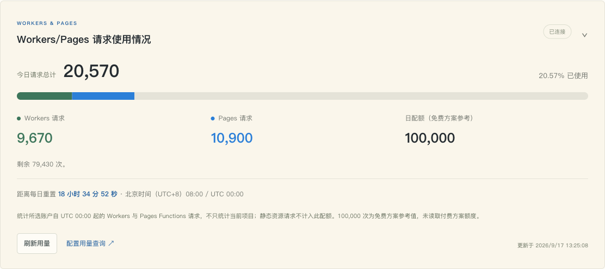

# Workers / Pages 请求使用情况

v1.0.4 对照 [上游当前在线管理页](https://edt-pages.github.io/admin/) 补齐了概览页的独立用量面板。它从你的查询凭据取得统计，不使用示例截图中的数字。



图中是本地受控测试数据，用于说明界面。

## 接入自己的用量

1. 打开「概览 → Workers/Pages 请求使用情况 → 配置用量查询」，或进入「设置 → Cloudflare 用量」。
2. 选择一种认证方式：
   - **Account ID + API Token**：Token 需要 `Account → Account Analytics → Read` 权限，并限定到要查询的账户。
   - **账户邮箱 + Global API Key**：多账户时自动选择匹配账户；需要指定账户时使用上一种方式。
   - **自定义用量 API**：填写 HTTPS 地址。可对接自己的 [CF-Workers-UsagePanel](https://github.com/cmliu/CF-Workers-UsagePanel) 等服务。
3. 填写后点击「验证输入（不保存）」。通过后点击「保存用量配置」，后台自动查询并更新面板。
4. 以后点击「刷新用量」查询最新数据。页面时钟每秒更新倒计时，不会因此每秒请求 Cloudflare。

凭据只通过本站 HTTPS 请求体发送给当前 Worker，保存在独立 `cf.json` 中。验证新输入不会覆盖已保存凭据；自定义 API URL 回读仅显示固定掩码。更换认证方式后，保存会清除旧方式的字段。

## 怎样理解数字

- **Workers / Pages 请求**：所选账户自当日 UTC 00:00 起的两类请求，不仅是当前项目。Pages 数字指 Pages Functions 请求。
- **总量、分段条和百分比**：总量为两类请求之和，分段颜色对应分类数据。超过配额时仍显示真实百分比，条形不会出现负数或溢出。
- **日配额**：Cloudflare 查询沿用 100,000 次的免费方案参考值，未读取付费方案额度；自定义 API 使用其返回的 `max`。
- **每日重置**：免费方案在 UTC 00:00，即北京时间 08:00 重置。倒计时到点不会把旧查询结果伪造为零，而会提示刷新。
- **未配置 / 查询失败 / 零**：三个不同状态。没有有效数据时显示 `—`；仅查询成功且实际为零才显示 `0`。刷新失败会保留上次成功数据及更新时间。

官方依据：[Workers 日请求限制](https://developers.cloudflare.com/workers/platform/limits/#daily-request)、[Pages Functions 计费与共享配额](https://developers.cloudflare.com/pages/functions/pricing/)、[API Token 认证](https://developers.cloudflare.com/analytics/graphql-api/getting-started/authentication/api-token-auth/)。

## 自定义 API 格式

```json
{ "success": true, "workers": 9670, "pages": 10900, "total": 20570, "max": 100000 }
```

以上是说明格式的示例数据。各计数应为非负安全整数，`total` 等于 `workers + pages`，`max` 大于零。应使用同样的 UTC 日统计周期；接口失败、无效 JSON 或缺少统计字段时显示查询失败。

## 与在线示例的核对

2026-09-17 重新抓取 `/admin/`；无尾斜杠的 `/admin` 返回 301 后指向同页。两者最终均为 886,073 字节，SHA-256 为 `3cb5b5fb00f66fff155105a90ff6d20864e510b33874341b7f6563145b7fdca6`。

本次并非更换上游版本，而是纠正此前仅核对接口和设置页简表造成的遗漏。原版统计面板仅在查询成功时出现；本项目保留未配置/失败状态及配置入口，便于找到问题。原版通过 URL 传递查询密钥，本项目保持同源 POST 与服务端查询。

本地验证使用独立临时 KV 和受控响应，覆盖真实保存、查询、失败、跨日及并发状态；未使用用户的 Cloudflare 凭据或部署到生产环境。
