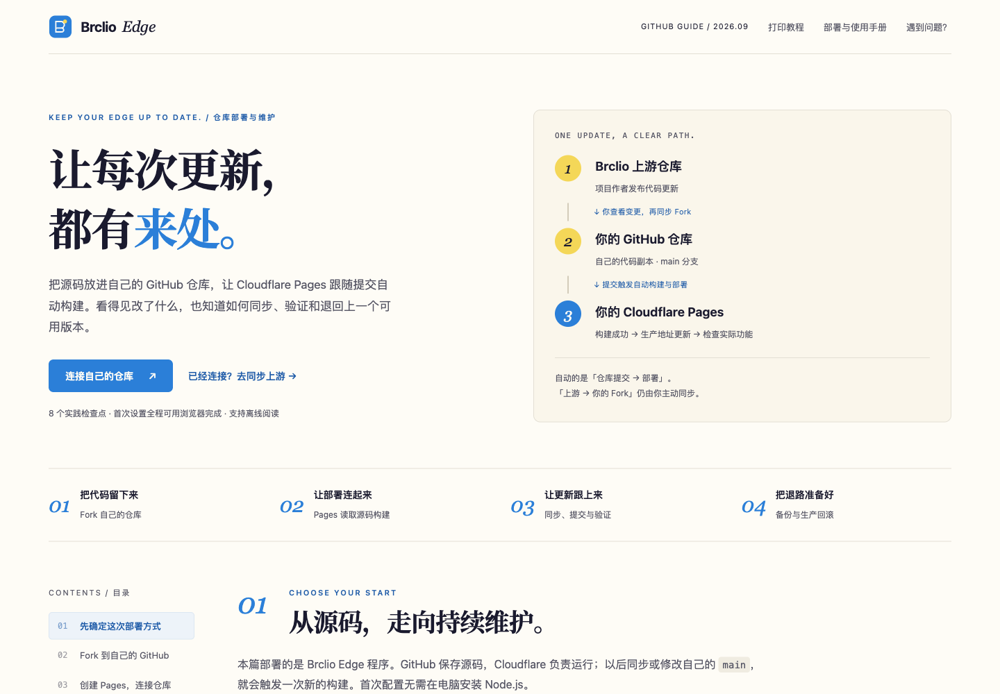

# 独立 HTML 教程验证

## 2026-09-17 · 图文增强与 GitHub 篇

对象：[部署与使用教程](tutorial.html) 与 [GitHub 部署与维护](github-deploy.html)。本轮实际执行 **56 项浏览器检查，全部通过**；其中主检查 50 项，复制、手机弹窗与互跳补充检查 6 项。详细逐项记录与两篇最终文件的 SHA-256 见 [illustrated-validation.json](tutorial-assets/illustrated-validation.json)。以下历史记录不计入本轮结果。

- 原教程加入全部 28 张用户提供的 Cloudflare 操作截图，与原有 9 张后台截图组成 37 张正文配图。新教程复用其中 4 张控制台图，另有原创流程示意、配置表和完整维护步骤。
- Cloudflare 源图为 27 张 5120×2704 与 1 张 3456×1924；按原生像素比例裁剪、加入编号、箭头与说明。账号、密码和 UUID 在输出 PNG 编码前裁除或实心遮盖，原始凭据图不随仓库分发。裁剪、分段、遮盖和哈希见 [截图清单](tutorial-assets/cloudflare-captures.json)。
- 所有配图支持点击放大、适应窗口、100% 原始尺寸、前后切图、键盘导航与下载。实际下载的两张标注 PNG 与素材文件逐字节一致。
- 两篇在 1440、900、390、320 px 宽度下，折叠内容关闭和全部展开时正文均无横向溢出；320 px 弹窗与工具栏可用，原始尺寸模式可滚动查看。
- 两篇的章节锚点、复制目标、唯一 ID、手机目录、FAQ 搜索、进度持久化通过；两篇进度分别保存，互不覆盖。原教程本地 UUID v4 生成通过。
- 实际读取剪贴板确认复制内容一致；两篇互相跳转与 GitHub 篇进度重置通过。
- 浏览器断网后直接打开两篇 HTML，全部内嵌图片可解码，放大功能可用；没有 JavaScript 运行错误或外部 HTTP 运行时请求。外部文档链接仍需联网，互跳需将两篇保存在同一文件夹。
- 构建器验证全部 PNG 尺寸与 SHA-256、脚本语法和字节一致性，检查未替换占位与远程运行资源。Noto Serif SC 标题子集覆盖两篇标题字符；`npm run check` 与 `git diff --check` 通过。
- GitHub 篇依据仓库构建、Wrangler 和 CI 配置，并核对 Cloudflare / GitHub 官方说明：包括 Direct Upload 不能原地转为 Git 集成、Pages 构建目录、环境隔离、重新部署、Fork 同步与生产回滚。官方链接放在对应步骤。

以上检查针对 v1.0.2 发布前的最终教程文件。发布准备还在 Node.js 22.23.2 下重新构建部署包，并通过 119 项应用自动化测试，0 失败、0 跳过；协议行为没有新增改动。Git 推送、云端 CI 和附件下载核验另见 [v1.0.2 Release](https://github.com/Brclio/brclio-cloudflare-tz/releases/tag/v1.0.2) 的发布记录。此次工作没有变更 Cloudflare 账号、DNS 或生产部署，也没有新增公网客户端验收。

### 最新预览

[](tutorial.html)

[手机预览](images/tutorial-mobile.png) · [打开图文教程](tutorial.html)

[](github-deploy.html)

[手机预览](images/github-tutorial-mobile.png) · [打开 GitHub 篇](github-deploy.html) · [源文件与维护说明](tutorial-src/README.md)

## 历史验证 · 2026-09-16

以下内容记录当时版本的范围、截图数量与哈希，不描述上述新版文件。

### v1.0.1 局部回归

本轮仅更新公开下载说明与 v1.0.1 附件链接，**实际执行 19 项浏览器检查，全部通过**。历史 50 项完整交互检查没有在本轮重跑，也不计入这 19 项。详细结果见 [validation.json](tutorial-assets/validation.json) 的 `latestVerification`。

- 使用独立 Playwright 会话 `brclio-release-qa`，在浏览器断网状态下直接打开 `file://` 教程，无需本地 HTTP 服务。
- 320、390、1440 px 三种宽度下，折叠内容关闭和全部展开时均无横向溢出。
- 准备项明确「下载部署包无需 GitHub 账号」，正文和 README 明确「无需登录 GitHub」，未保留私有仓库访问前提。
- Pages ZIP、Worker 与教程 HTML 三条附件链接均指向 `v1.0.1`；本轮核对链接地址，没有联网下载或验证待发布附件的远端可用性。
- 9 张原图均能离线解码为 1920×1200；静态复核的 10 个内嵌实例（概览复用一次）与原始 PNG、截图清单 SHA-256 全部一致。
- 内嵌字体正常加载，脚本正常初始化；本轮没有 JavaScript 运行错误或外部 HTTP 请求。

最终教程 SHA-256：

```text
b4e624321bf45a1966bfc30169551849721f811ee6d19678cb67a93cdc2e6aad
```

### v1.0.0 历史完整检查

以下 50 项来自先前完整检查；当时的教程 SHA-256 为 `c916567eeeb8717554fea6376a340d21a4bd3e0d609fe006da6ab35147130406`。该轮包含 Release 预构建下载入口与本地 UUID 生成；发布前另补齐 Worker 与 Pages 包内的组件许可，未改动隧道逻辑。

**历史完整检查 50 项通过**，原始结果保留在 [validation.json](tutorial-assets/validation.json) 的 `browserChecks` 与 `finalArtifactChecks`；`historicalFullRun` 标明其版本与原文件 SHA-256。

- 桌面与手机宽度：1920、1440、1024、900、768、390、375、320 px，正文无横向溢出。320 px 展开全部折叠内容后仍通过。
- 目录定位、当前章节、短桌面视口目录滚动，以及手机目录的打开、跳转、Esc 关闭和 Tab 焦点循环通过。
- 8 步勾选、刷新后恢复与重置通过；进度仅保存在浏览器。
- 复制得到真实多行命令；问题搜索、无结果提示和清空恢复通过。
- 本地生成符合格式的 UUID v4，每次生成不同；复制一致、不写入存储，刷新后清除。Release 下载链接指向正确版本附件。
- 原图弹窗、适应窗口、100% 尺寸、Esc 关闭与焦点恢复通过。
- 实际下载概览 PNG，下载文件 SHA-256 与仓库原图逐字节匹配。
- 本地 HTTP 与直接 `file://` 打开通过；关闭网络后，正文、交互、本地字体和 9 张图均可用。
- 禁用 JavaScript 后仍能阅读完整 12 章正文和截图；打印前展开内容、打印后恢复状态通过。
- 浏览器无 JavaScript 运行错误，阅读与操作未产生外部 HTTP 请求。

### 图片与字体

9 张管理界面截图全部为 **1920×1200 的原生视口 PNG**，没有裁剪、缩放、重新编码或后处理。凭据通过应用原有遮盖控件隐藏。拍摄过程中没有触发网络查询、测速、消息发送或服务配置变更。

HTML 内有 10 个图片实例，其中概览同时用于封面和正文；它们解码后均与各自源 PNG 完全一致。尺寸、URL、滚动位置、时间与 SHA-256 记录见 [local-captures.json](tutorial-assets/local-captures.json)。

Noto Serif SC 700 已核对全部标题字符覆盖，并保留完整 OFL。字体来源和重建方式见 [font-provenance.json](tutorial-assets/font-provenance.json)。

### 内容与结构

- README 本地文档与图片链接存在，教程页内锚点、复制目标和 ARIA 引用有效，无重复 ID。
- 标题层级、表头、输入标签、可见焦点及减少动态设置已检查。
- 对照当前项目源代码核对保存范围、订阅格式、手动测速、备份与下载行为。
- Cloudflare 上传、KV、机密、自定义域、Workers 域名和 gRPC 条件，以及 v2rayN 订阅步骤，按各自官方文档核对。
- 原图说明对应实际画面；订阅默认值与初次设置建议的区别已说明。
- 生成器验证图片哈希、PNG 宽高、内嵌脚本字节一致性与语法，并拒绝未替换占位或远程运行资源。

### 验证范围

以上验证针对文档和本地实际管理界面的截图，不代表在个人 Cloudflare 账号新建资源、迁移 DNS 或完成公网客户端验收。教程中的 Cloudflare 和客户端步骤由官方文档与项目实现核对；本轮未登录或变更生产账号，发布版本另完成 119 项自动化测试。项目功能的独立验证记录见 [validation.md](validation.md)。
