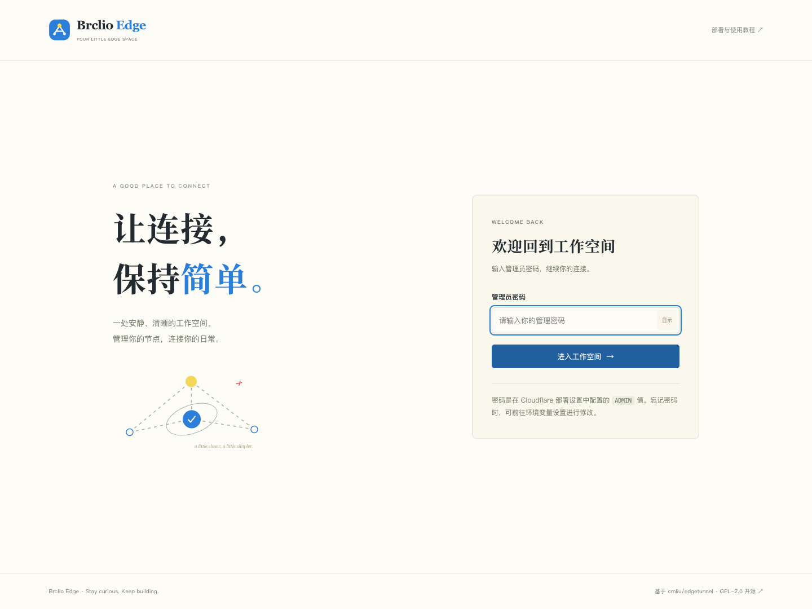
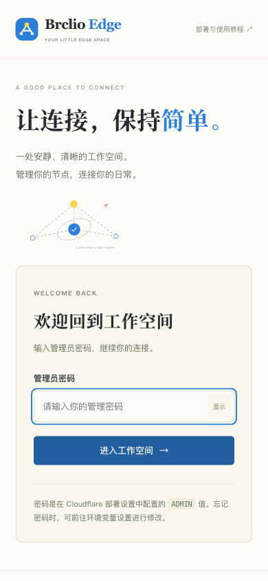

# 本地验证记录

核验日期：2026-09-15。这里记录实际执行过的检查，便于维护者复现；不代表已在 Cloudflare 生产环境部署。

## 构建与自动化检查

| 检查 | 实际结果 |
| --- | --- |
| `npm run build` | 通过，生成独立 Worker、Pages 目录和 ZIP |
| `npm run check` | src、public/assets、scripts 中全部 JavaScript / MJS 语法通过 |
| `npm test` | 117 项通过，0 失败，0 跳过 |
| `npm audit` | 当前锁定依赖报告 0 个已知漏洞 |
| `wrangler deploy --dry-run` | 通过，未上传；报告 gzip 约 612.95 KiB |
| ZIP 完整性 | CRC 检查通过；根目录包含 `_worker.js`、`_routes.json` 与许可文件；Worker 与独立构建文件逐字节相同 |
| `git diff --check` | 通过 |

首次完整运行环境为 macOS、Node.js 26.5.0、Wrangler 4.131.2；测试使用锁文件中固定的 Miniflare / workerd。构建中的 15 个本地资源包含页面、样式、脚本、SVG、字体及许可文件。ZIP 不含本地密码、缓存或 `node_modules`。

另外使用 **Node.js 22.23.2** 完整重建并运行全部测试，结果同样为 **117 / 117 通过，0 失败、0 跳过**，验证 README 和 CI 指定的 Node 22 环境兼容性。

### 自动化测试覆盖

- **管理流程**：未认证访问、正确与错误密码、跨站请求拦截、已签名会话过期、登出后的会话重放、缺少 ADMIN / KV 时的初始化提示。
- **配置持久化**：加载默认值、修改与重读、保留未知高级字段、拒绝错误对象结构、错误数字类型、无效 URL、无效路径模板及不支持的加密方式。
- **独立设置**：优选地址原文存取、CF / TG 凭据单独存储、部分更新保留其他凭据、拒绝脱敏占位文本、明确移除与 POST 重置。
- **订阅生成**：自定义地址生成 VLESS、Trojan、Shadowsocks 订阅；随机候选 CIDR 的格式过滤和空结果回退。打开空地址编辑器不会生成虚假的已保存地址，也不会出站请求。
- **用量查询**：从已存凭据读取、拒绝 URL 中携带凭据、校验返回结构，处理空值、错误内容与超过四秒的响应。
- **实际数据转发**：21 项协议用例，通过运行中的 workerd 连接测试进程自己的 TCP 回声服务。WebSocket 覆盖 VLESS、Trojan、Shadowsocks AES-128-GCM / AES-256-GCM；gRPC gun / multi 与 XHTTP 覆盖 VLESS、Trojan。分别验证首包、后续 64 KiB 字节一致与错误认证拒绝。此次修复了 gRPC multi 多个 protobuf 数据字段被错误转发的问题，并覆盖截断 / 无效帧。
- **管理工具与路由**：固定来源目录、转换后端版本识别与地址规范化、IP / ProxyIP 参数、Telegram 显式发送参数；真实构建 Worker 下确认 camelCase 路由、认证、同源、方法与 JSON 校验，防止落回 HTML。路由测试禁止出站请求；模块测试只访问本机受控响应服务。
- **独立部署下载**：需要有效会话；下载 Worker 与构建逐字节一致，ZIP 含同份源码和许可证。两种下载得到的 Worker 均在新 workerd 中重新启动，能再次生成一致的源码和包。测试注入的环境秘密及 KV 中 CF / TG 凭据（含其 Base64）不在下载内容中。
- **手动测速核心**：加载零请求、有限队列不重启、停止后不继续取队列；IPv4 / IPv6 / CIDR / 范围解析、4096 候选边界、随机 TLS 端口去重；按实际流读取下载字节，到达流量上限即取消，手动停止不编造速度。

用量查询使用可控的测试响应；TCP 测试只连接本机自建服务。gRPC / XHTTP 使用 workerd HTTP 请求入口，不代表已在真实 Cloudflare HTTP/2 边缘或客户端上验收。它们没有使用真实 Cloudflare API 凭据、Telegram Bot 或公共代理目标。

## 真实浏览器操作

在 Chromium 中连接独立本地 Worker `http://localhost:8788` 与本地 KV，实际点击和填写界面：

| 流程 | 结果 |
| --- | --- |
| 登录、错误密码、退出后重新登录 | 正常显示反馈和跳转 |
| 修改节点名称、切换 Trojan、保存并刷新 | 数据保留，订阅链接同步更新 |
| 保存一行自定义地址，关闭随机 IP 并保存主配置 | 两组设置分别持久化 |
| 切换通用 / Base64、复制订阅、下载文件 | 剪贴板与链接一致；下载内容解码后含预期 Trojan 协议及自定义主机 |
| 输入错误 JSON，再应用有效 JSON | 错误被提示；修正后可以保存 |
| 添加表单之外的高级字段，保存并重新加载 | 高级字段保留 |
| 导出 JSON，再通过文件选择器导入并保存 | 备份恢复；导出文件不含 CF / TG 独立凭据与运行时订阅 token |
| 重置先取消、再确认 | 取消保留配置；确认恢复默认值 |
| 日志关键词和类型筛选 | 无匹配时显示空状态，恢复条件后显示实际记录 |
| 手机菜单切换七个页面 | 可正常打开和关闭，关闭后侧栏不可被键盘聚焦 |

验证结束后，测试节点设置恢复为默认 VLESS，临时自定义地址已清空。所有地址示例只用于序列化验证，没有连接示例域名。

### 本次功能对齐与手动测速验收

通过 Chromium 的真实按钮操作，给测速和目录请求提供受控响应。以下次数是浏览器发起的实际 fetch 次数；受控响应中的地区、速度不作为公网测速结果。

| 操作 | 实测结果 |
| --- | --- |
| 重新加载、等待 3.1 秒、切换节点/测速页再等待 2.2 秒 | 0 次外部探测 |
| 两个网站，每站两次延迟采样 | 共 4 次请求；完成后等待 2.4 秒仍为 4 次 |
| 生成两个候选 | 0 次出站；只有本地数据生成 |
| 两个候选做一轮延迟检测 | 2 次请求，响应地区/colo/类型正确展示；结束后不重复 |
| 仅选中一个地址做下载测速 | 1 次下载、按返回字节显示 Mbps；结束后不重复 |
| 单并发检测开始后点击停止 | 已发 1 次，第二个候选不再启动 |
| 检测开始后切换到其他页面 | 已发 1 次，剩余候选取消；返回页面不会重启 |
| 4096 个候选及下一页 | 生成无网络请求；实际每页最多 100 行，共 41 页 |
| 无效 IPv4 输入 | 页面提示具体行与错误，未发生未捕获异常 |
| 优选结果追加到 ADD、保存地址与主配置、刷新 | 地址实际保留；随机 IP 已关闭；验证后恢复空 ADD 与随机 IP 默认值 |
| 订阅二维码 | 本地 SVG 有实际模块；0 次额外外部请求；关闭后销毁 DOM |
| 本地工具目录 | 手动加载受控目录，GUI/CLI 筛选正确 |
| 公开代理目录与地区选择 | 0 次代理检查；点击验证后 12 个候选各检查一次 |
| 代理验证完成后等待，再次开始后点击停止 | 完成后不重复；第二轮只启动 8 个并发任务，剩余 4 个不再启动 |
| HOSTS 不匹配提示与 24 小时忽略 | 受控配置显示正确域名，忽略后刷新仍隐藏；恢复真实配置 |
| 关闭 Shadowsocks TLS 先取消、再确认 | 取消保留 true 且未标修改；确认后变 false；重新开启后与保存基线一致 |

公共 ProxyIP 来源在一次本地尝试中返回不可连接（502），界面显示失败状态；目录与代理行为使用受控响应继续验收。这说明入口有错误反馈，不代表第三方公共地址当前可用。未发送真实 Telegram 测试消息。

### 响应式与资源

- 在 **390、768、900、1440 px** 宽度下依次检查七个后台页面，共 28 种页面/宽度组合（含展开高级工具）：文档无横向溢出，日志与代理表格可在自身容器滚动。修复了 390 px 下代理目录的最小表格宽度撑开编辑器的问题。
- 目视检查桌面和手机的概览页、登录页：标题、表单、主要操作可见，无裁切。
- 后台浏览资源全部为当前站点同源资源，没有外部字体、管理 HTML 或 CDN 脚本请求。
- 最终页面切换检查中没有 JavaScript 运行错误；故意输入错误密码产生的 HTTP 401 是预期行为。

## 界面截图

这些是本项目运行中的实际截图。`localhost` 与 `::1` 为本地测试环境；Wrangler 提供的模拟地区字段不表示真实出口地区。用量未接入时明确显示「未接入」。截图没有显示管理密码、UUID 或订阅凭据。

### 桌面管理页

### 桌面登录页

### 手机界面

| 管理概览 | 登录页 |
| --- | --- |
|  |  |

### 手动测速页面

初始页面没有测试结果，不自动探测；结果仅在点击测试后产生。

| 夜间主题 | 手机测速 |
| --- | --- |
|  |  |

## 尚未执行的验收

- 未推送 GitHub、创建 Release 或执行线上 Cloudflare 部署；GitHub Actions 文件已提供，但未宣称云端 CI 已运行。
- 未修改真实域名、DNS、账号机密或线上 KV。
- 未在真实客户端和公网环境完成 VLESS / Trojan / Shadowsocks、gRPC / XHTTP、代理出口、UDP、ECH、第三方订阅转换的完整组合测试。
- 未使用真实凭据验证 Cloudflare 用量或 Telegram 通知投递，也未做实际手机硬件与 Safari / Firefox 验证。

上线验收应按 [README](../README.md) 完成绑定、重新部署、订阅更新和客户端连接；后台页面正常加载本身不是公网连通证明。

## v1.0.0 发布前复核 — 2026-09-16

- Node.js 22.23.2，干净执行 `npm ci`，锁定依赖报告 0 个已知漏洞。
- `npm run check` 与完整 `npm test` 通过：**119 项，0 失败，0 跳过**。新增两项检查验证发行 ZIP 的准确文件清单与 Worker 随附许可的逐字一致性。
- 补齐 fflate 0.8.3 的 MIT 许可：独立 Worker 含 16 个本地资源，Pages ZIP 根目录 8 个文件，包括 fflate、二维码与字体许可。
- `wrangler deploy --dry-run` 通过，gzip 约 **614.31 KiB**；未上传 Cloudflare。
- 独立教程使用现成版本下载作为主流程，源码构建保留为可选；浏览器内本地生成 UUID，无需安装 Node.js。教程 **50 项浏览器检查通过**，含离线、320–1920px 布局、复制、UUID、原图与打印状态，见 [教程验证](tutorial-validation.md)。
- 发布时只取明确的 Worker、Pages ZIP、教程和构建清单，另生成源码提交与 SHA-256 清单；不打包 `dist/dry-run`、本地变量或 KV 数据。Release 附件的校验信息见版本内 `release-manifest.json` 与 `SHA256SUMS.txt`。

本段验证适用于发布版本；前面的 117 项及原始浏览器记录保留为 2026-09-15 的初次验收事实。
